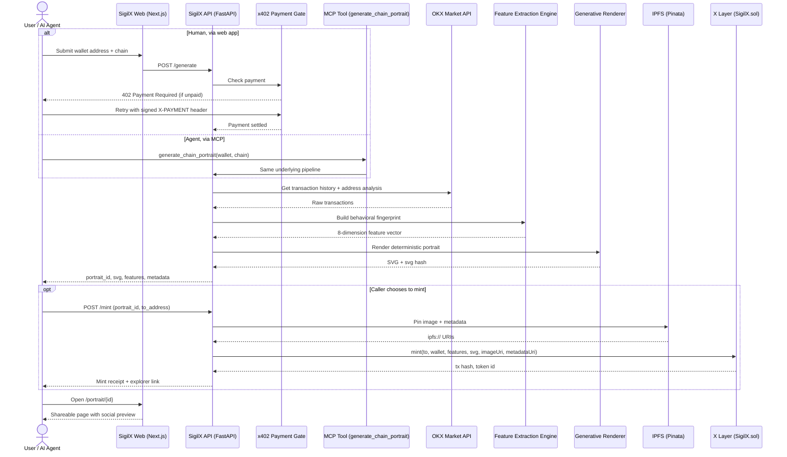

<p align="center">
  
</p>

# SigilX

Turn any wallet's onchain behavior into a unique, shareable generative artwork.

SigilX is an Agent Service Provider (ASP) built for the OKX.AI Genesis Hackathon, designed for
the Artistic Excellence track. It transforms a wallet's transaction history into a deterministic
visual identity: part portrait, part fingerprint, part collectible. Instead of asking why Spotify
gets a Wrapped and Duolingo gets a Year in Review, SigilX asks a simpler question: why not your
wallet? Spotify's 10th annual Wrapped was its largest ever, spanning 184 markets and 53 languages
with user engagement up 10% year over year. Spotify also said Wrapped reached a record 227 million
monthly active users in 2023, showing how powerful personalized annual recaps can be when they are
visual, emotional, and shareable.

Wallets already contain the same ingredients that make recap products compelling: behavior,
identity, patterns, habits, milestones, and stories. But crypto users still mostly experience that
history as raw explorer data, CSV exports, and protocol dashboards. SigilX turns that behavioral
history into art.

---

## The Idea

A wallet address is more than a string. It is a timeline of decisions: swaps, holds, bursts of
activity, dormancy, experimentation, conviction, panic, curiosity, and repetition. SigilX reads
that history and converts it into a reproducible visual signature.

**One-line pitch:** SigilX turns any wallet's onchain transaction history into a deterministic
generative portrait that can be viewed, shared, and minted.

### What makes it different

- It is not a wrapped third-party image model.
- It uses wallet behavior itself as the creative input.
- The same wallet always generates the same core artwork.
- Different wallet behaviors produce visibly different styles.
- The output is both artistic and interpretable.

A high-frequency wallet might generate dense, chaotic, fragmented geometry. A patient long-term
holder might generate slower, cleaner, more symmetrical forms. The artwork is not random
decoration; it is the visual expression of onchain behavior.

### Why this matters

Personalized recap products work because they turn invisible behavior into identity. Spotify
Wrapped became a cultural ritual because it made user data feel emotional and worth sharing, and
Spotify has said the campaign now reaches users in 184 markets globally. Duolingo has also built
massive engagement through habit-driven personal learning journeys, and the company reported 65%
daily active user growth in its 2023 results, showing how powerful personalized progress loops can
be in consumer apps.

Crypto has scale, but it still lacks emotionally legible consumer experiences around identity.
Wallet history is rich, but it is not memorable, social, or creative by default. SigilX closes
that gap by turning utility data into cultural output.

---

## Problem

Current wallet tools help users inspect balances, transactions, and portfolio performance, but
they do not help users feel their onchain identity. Explorer pages are functional. Analytics
dashboards are numerical. NFT profile systems are often static. None of them transform behavioral
history into a portable piece of visual self-expression.

That leaves a gap:

- No native "Wrapped for your wallet" moment.
- No artistic summary of onchain behavior.
- No shareable visual identity generated from actual transaction patterns.
- No collectible artifact that reflects how a wallet behaves over time.

---

## Solution

SigilX is an A2MCP ASP that takes structured inputs and returns a deterministic result. A user
submits a wallet address and selected chain. The service retrieves transaction history, extracts
behavioral features, maps those features to a generative art system, and returns a unique
portrait plus its underlying stats.

**Input**
- Wallet address
- Chain
- Optional style mode or render preset

**Output**
- High-resolution generative artwork
- Behavioral stats summary
- Deterministic feature fingerprint
- Mint-ready metadata package
- Public shareable page with social preview

---

## How It Works

**1. Wallet history ingestion**
SigilX pulls wallet-level transaction history and related signal data from OKX infrastructure
instead of relying on a custom indexer.

**2. Behavioral fingerprint extraction**
The service computes a feature vector from transaction activity, including patterns such as:

- Transaction frequency
- Burstiness
- Temporal regularity
- Amount distribution
- Protocol diversity
- Token concentration
- Risk appetite proxies
- Recurrence patterns

This stage is where entropy and chaos-style analysis becomes the artistic backbone.

**3. Generative art mapping**
The fingerprint is mapped to visual parameters such as:

- Palette
- Geometry family
- Stroke density
- Symmetry level
- Motion rhythm
- Noise intensity
- Layer depth
- Composition spread

**4. Rendering**
The renderer generates a deterministic portrait in SVG, Canvas, or WebGL form. The same wallet
produces the same base result, which gives the artwork identity and collectible continuity.

**5. Minting and sharing**
The user can mint the final portrait as an NFT with its stats embedded in metadata, then receive
a public share link with Open Graph preview support for posting on X.

---

## Why OKX.AI Is the Right Home

SigilX fits the A2MCP model cleanly because the service can be expressed as: wallet address in,
artwork plus stats out. OKX's A2MCP path is specifically meant for standardized callable services
with pay-per-call billing and instant settlement through the OKX payment flow. That makes SigilX a
strong marketplace-native art service rather than just a standalone web app.

### OKX-native components

- OKX Market API for transaction and address-level behavioral data inputs.
- Onchain OS + Agentic Wallet for ASP identity and registration.
- OKX Payment SDK / x402 for A2MCP pay-per-call monetization.
- X Layer for minting and final collectible settlement.

---

## Architecture

```
Wallet Address
    -> OKX transaction / address data
    -> Feature extraction engine
    -> Behavioral fingerprint
    -> Generative renderer
    -> Artwork + stats
    -> Optional mint on X Layer
    -> Shareable public page
```

Wrapped as:

```
FastAPI -> MCP wrapper -> HTTPS deployment -> x402 payment gate -> OKX.AI listing
```

---

## Sequence Diagram



---

## User Flow

1. User submits wallet address.
2. SigilX pulls onchain history.
3. Behavioral fingerprint is computed.
4. Portrait is rendered live.
5. User receives artwork, stats, and share page.
6. User optionally mints the portrait.
7. User posts the result on X.

---

## Example Outputs

**Wallet A: Hyperactive trader**
- Dense composition
- High contrast palette
- Sharp geometry
- Chaotic motion fields
- Fragmented layering

**Wallet B: Long-term holder**
- Sparse composition
- Balanced symmetry
- Calm gradients
- Slower visual rhythm
- Stable geometry

The contrast between these portraits is what makes the idea socially compelling. Two users do not
just get "different images"; they get visualized identities.

---

## Business Model

SigilX is designed as a paid art service, not just a demo.

### Monetization options

- Pay per generation
- Premium charge for minting
- Limited-edition themed render packs
- Creator drop collaborations
- Branded partner campaigns for communities or DAOs

This structure also gives the project upside beyond Artistic Excellence. Personalized recap
experiences are inherently shareable, and Spotify's own reporting shows Wrapped is one of its
biggest engagement engines, which supports the case that identity-driven visual outputs can also
drive strong organic distribution.

---

## Why This Can Win Artistic Excellence

Most hackathon "art" projects simply wrap existing image models. SigilX is different because the
core creativity is in the transformation system itself: the behavioral feature design, the
mapping from data to visual language, the determinism, the emotional legibility, and the
collectible presentation.

This is not "generate me a pretty image." It is algorithmic portraiture for wallets.

---

## Demo Plan

### 90-second story

1. Paste Wallet A and generate a portrait live.
2. Paste Wallet B and show a visibly different result.
3. Open both stats panels and explain the fingerprint.
4. Mint one portrait on X Layer.
5. Open the shareable link and show the social preview.
6. End with the line: *Spotify Wrapped gave music listeners a yearly identity moment. SigilX gives
   wallets theirs.*

---

## Submission Positioning

**Primary track:** Artistic Excellence

**Secondary upside**
- Social Buzz, because every output is naturally shareable.
- Revenue Rocket, because every generation and mint can be monetized.

**Tagline options**
- Your wallet, rendered as identity.
- Every wallet has a fingerprint. SigilX turns it into art.
- The generative portrait of your onchain life.
- Wrapped, but for your wallet.

---

## Final Positioning

SigilX sits at the intersection of onchain identity, generative art, and shareable consumer
ritual. Spotify proved that users love data when it is beautifully reframed, with Wrapped reaching
hundreds of millions of users and becoming a global annual event. SigilX brings that same
emotional logic to crypto: not another dashboard, not another explorer, but a wallet-native
artistic artifact that people want to see, mint, and share.

---

*MIT © 2026 SigilX / Suganthan96 — built for the OKX AI Genesis Hackathon 2026.*
